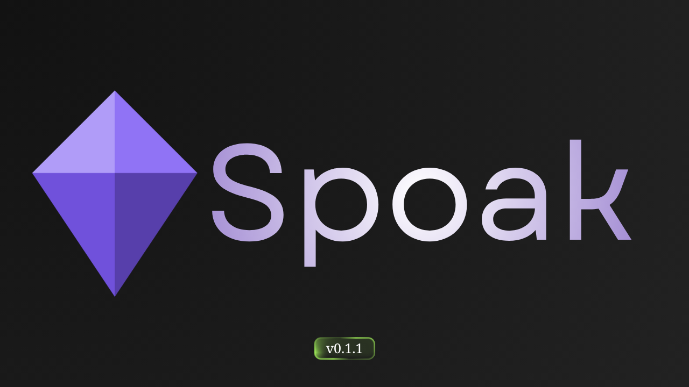

# Spoak Frontend v0.1.1

Minecraft sunucu yöneticileri ve oyuncuları için araç koleksiyonu. Next.js 16 ile geliştirilmiş, Rust tabanlı [spoak-backend](https://github.com/spoakk/backend) ile çalışır.

[](https://github.com/spoakk/backend)

## Araçlar

| Araç | Açıklama |
|------|----------|
| Server Jars | Leaf, Paper gibi sunucu jar dosyalarını indir |
| BAT Generator | Sunucu başlatma script'i oluştur |
| MC Ping | Minecraft sunucusunu ping'le, oyuncu listesini gör |
| MiniMessage | MiniMessage formatını önizle ve düzenle |
| Small Text | Unicode küçük metin dönüştürücü |
| Nether Coords | Overworld ↔ Nether koordinat hesaplayıcı |
| Player Profile | UUID, skin ve oyuncu bilgilerini sorgula |
| Server Icon | 64×64 sunucu ikonu oluştur ve önizle |
| Give Command | `/give` komutu oluşturucu |
| Seed Map | Minecraft dünya seed haritası görüntüleyici |

## Kurulum

```bash
npm install
```

## Geliştirme

```bash
npm run dev
```

## Build

```bash
npm run build
npm run start
```

## Ortam Değişkenleri

`.env.example` dosyasını `.env.local` olarak kopyalayıp doldurun:

```bash
cp .env.example .env.local
```

| Değişken | Açıklama |
|----------|----------|
| `NEXT_PUBLIC_API_URL` | Backend API adresi |
| `NEXT_PUBLIC_SITE_NAME` | Site adı |
| `NEXT_PUBLIC_DEFAULT_LOCALE` | Varsayılan dil (`en` veya `tr`) |
| `NEXT_PUBLIC_REOWN_PROJECT_ID` | Reown (WalletConnect) proje ID'si |
| `NEXT_PUBLIC_SENTRY_DSN` | Sentry DSN |
| `SENTRY_ORG` | Sentry organizasyon adı |
| `SENTRY_PROJECT` | Sentry proje adı |

## Teknolojiler

- [Next.js 16](https://nextjs.org) — React framework
- [Tailwind CSS 4](https://tailwindcss.com) — Stil
- [Framer Motion](https://www.framer.com/motion) — Animasyonlar
- [TanStack Query](https://tanstack.com/query) — Veri yönetimi
- [i18next](https://www.i18next.com) — Çoklu dil (TR/EN)
- [skinview3d](https://github.com/bs-community/skinview3d) — 3D skin renderer
- [Sentry](https://sentry.io) — Hata takibi
- [Reown AppKit](https://reown.com) — Web3 cüzdan bağlantısı

## Linkler

- [GitHub](https://github.com/spoakk)
- [Discord](https://discord.gg/SBbU3rCtGe)
